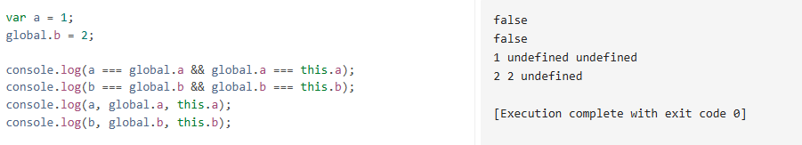
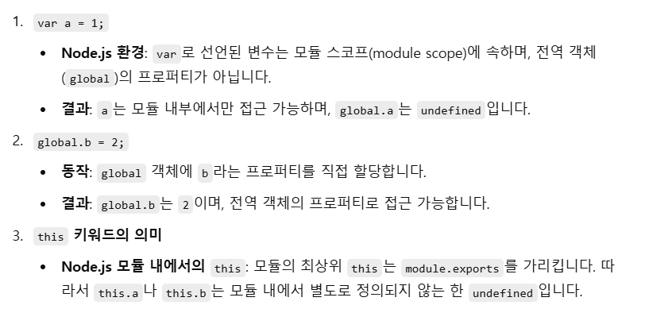
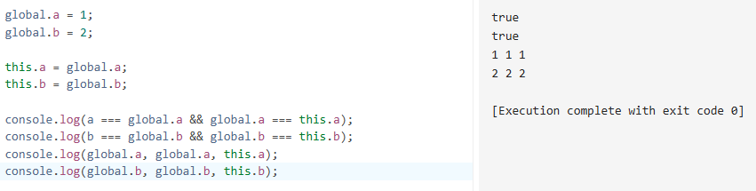

# 03 this

## 01. 상황에 따라 달라지는 this

### this - 실행 컨텍스트가 생성될 때 결정 : 함수를 호출할 때 결정됨

### 전역 공간 : this == 전역 객체

※ 자바스크립트의 모든 변수는 특정 객체의 프로퍼티로서 동작함

-> 전역변수를 선언하면 자바스크립트 엔진은 이를 전역 객체의 프로퍼티로 할당함

-> var로 변수 선언의 동작 == window 프로퍼티에 할당의 동작

-> delete 명령 - var로 변수 선언의 동작 != window 프로퍼티에 할당의 동작

=> 자바스크립트 엔진은 전역변수를 전역객체의 프로퍼티로 할당하지만 해당 프로퍼티의 변경 및 삭제 가능성을 false로 정의한다.

```js
var a = 1;
global.b = 2;

console.log(a, global.a, this.a);
console.log(b, global.b, this.b);
----------------------------------
delete global.a;
console.log(a, global.a, this.a);

delete global.b;
console.log(b, global.b, this.b);
```

question) 

answer) 


### 함수 / 메서드 공간 : this - 함수와 메서드로서의 호출이 달라짐 : 변수에 담아 호출한 경우와 객체의 프로퍼티에 할당해서 호출한 경우에 따라 달라짐

메서드로서 호출하는 경우 호출 주체는 함수명 앞의 객체임

함수로서 호출 : this가 지정되지 않음 , 전역 객체를 가리킴

- 내부함수에서의 this 우회 : 상위 스코프의 this를 저장해서 내부함수에 활용
- [화살표 함수]() : this를 바인딩하지 않는 함수

[콜백 함수](#콜백함수--함수-a의-제어권을-다른-함수-또는-메서드-b에게-넘겨주는-경우-함수-a) 내부에서의 this : 기본적으로 전역객체를 참조하지만 제어권을 받은 함수에서 별도로 this가 될 대상을 지정할 수 있다.

[생성자 함수](#생성자함수--어떤-공통된-성질을-지니는-객체들을-생성하는-데-상요하는-함수--구체적인-인스턴스를-만들기-위한-일종의-틀틀) 내부에서의 this : 새로 만들 구체적인 인스턴스 자신이 됨

## 02. 명시적으로 this를 바인딩하는 방법

### call 메서드 : 메서드의 호출 주체인 함수를 즉시 실행하도록 하는 명령어

```js
function prototype.call(thisArg[, arg1[, arg2[, ...]]])
```

- 첫 번째 인자를 this로 바인딩하고, 이후의 인자들을 호출할 함수의 매개변수로 함
- 임의의 객체를 this로 지정 가능

### apply 메서드 : 메서드의 호출 주체인 함수를 즉시 실행하도록 하는 명령어

```js
function prototype.apply(thisArg[, argsArr])
```

- 두 번재 인자를 배열로 받아 그 배열의 요소들을 호출할 함수의 매개변수로 지정한다.
- 임의의 객체를 this로 지정 가능

### ※ call / apply 메서드 : 별도의 this를 바인딩하면서 함수 또는 메서드를 실행 가능 / this를 예측하기 어렵게 만들어 코드 해석을 방해함함

ex) 유사배열객체에 적용

- 키가 0 또는 양의 정수인 프로퍼티, length 프로퍼티의 값이 0 또는 양의 정수인 객체의 경우

ex) arguments, nodeList에 적용

ex) length 프로퍼티를 가지는 문자열에 적용

- 문자열의 경우에는 원본 문자열에 변경을 가하는 메서드는 에러 발생, 대상이 배열이어야 하는 경우의 메서드는 제대로 된 결과를 얻을 수 없음

=> 이러한 활용법은 코드만 봐서는 의도를 파악하기가 어려움

∴ ES6-> Array.from : 유사배열객체 / 순회 가능한 모든 종류의 데이터 타입을 배열로 전환함

ex) 생성자 내부에서 다른 생서자 호출

- 생성자 내부에 다른 생성자와 공통된 내용이 있을 경우 간단하게 반복을 줄일 수 있음

ex) 여러 인수를 묶어 하나의 배열로 전달하고 싶을 때 - apply

- ES6 -> 펼치기 연산자 적용 가능

### bind 메서드 : 함수를 즉시 호출하지 않고 넘겨 받은 this 및 인수들을 바탕으로 새로운 함수 반환

```js
function prototype.bind(thisArg[, arg1[, arg2[, ...]]])
```

- 함수에 this를 미지 적용하는 것, 부분 적용 함수를 구현하는 두 가지 목적을 지님

- name 프로퍼티에 bound(bind의 수동태)가 붙음 : 원본 함수에 bind 메서드를 적용한 새로운 함수라는 의미

### ※ call, apply, bind 메서드 이용 시 상위 컨텍스트의 this를 내부함수나 콜백 함수에 전달할 수 있다.

---

---

#### 콜백함수 = 함수 a의 제어권을 다른 함수 또는 메서드 b에게 넘겨주는 경우, 함수 a

-> 콜백 함수를 인자로 받는 메서드 중 일부는 추가로 this로 지정할 객체(thisArg)를 인자로 지정할 수 있다.

- thisArg 값을 지정하면 콜백 함수 내부에서 this 값을 원하는 대로 변경 가능
- ```js
  Array.prototype.forEach(callback[, thisArg])
  Array.prototype.map(callback[, thisArg])
  Array.prototype.filter(callback[, thisArg])
  Array.prototype.some(callback[, thisArg])
  Array.prototype.every(callback[, thisArg])
  Array.prototype.find(callback[, thisArg])
  Array.prototype.findIndex(callback[, thisArg])
  Array.prototype.flatMap(callback[, thisArg])
  Array.prototype.from(arrayLike[callback[, thisArg]])
  Set.prototype.forEach(callback[, thisArg])
  Map.prototype.forEach(callback[, thisArg])
  ```

#### 생성자함수 = 어떤 공통된 성질을 지니는 객체들을 생성하는 데 상요하는 함수 : 구체적인 인스턴스를 만들기 위한 일종의 틀

#### 화살표 함수

-> 실행 컨텍스트 생성 시 this를 바인딩하는 과정이 제외됨

- 함수 내부에는 this가 없음, 접근 시 스코프체인상 가장 가까운 this에 접근함
