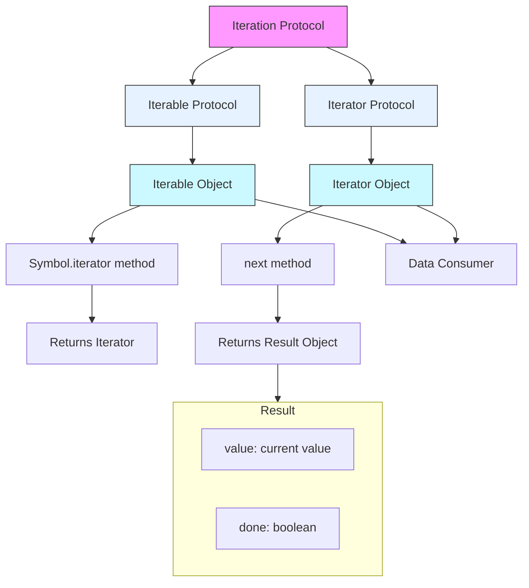

# 33장. 7번째 데이터 타입 Symbol

## Symbol이란?

> ES6에서 도입된 7번째 데이터 타입

### 특징

- 변경 불가능한 원시 타입 값
- 다른 값과 중복되지 않는 유일무이한 값
- 문자열이나 숫자로의 암묵적 형변환은 불가능
- 불리언 타입으로는 암묵적 형변환이 가능
- 객체처럼 접근 시 래퍼 객체 생성

### 1. Symbol 생성 방식

#### 1.1 Symbol 함수 호출

```js
// 기본 생성
const mySymbol = Symbol();
const mySymbol2 = Symbol("설명"); // 디버깅용 설명 추가 가능

// new 연산자로는 호출 불가
const mySymbol3 = new Symbol(); // TypeError
```

#### 1.2 `Symbol.for` / `Symbol.keyFor` 메서드

##### 1.2.1 `Symbol.for(key)`

> 전역 심벌 레지스트리에서 인수로 전달받은 문자열을 키로 사용하여 심벌 값을 검색하거나 생성

특징:

- 전역 심벌 레지스트리에서 심벌 값을 공유
- 없으면 새로운 심벌 값을 생성하여 레지스트리에 저장
- 문자열이 아닌 인수는 문자열로 변환
- 같은 키로 호출하면 항상 같은 심벌 값 반환

반환값: 심벌(Symbol) 타입의 값

```js
// 전역 심벌 레지스트리에 새로운 MySymbol이라는 키로 저장된 심벌 값이 없으면 새로운 심벌값 생성
const s1 = Symbol.for("MySymbol");
console.log(s1); // Symbol(MySymbol)

// 같은 키로 검색하면 같은 심벌 값 반환 (이미 있으면 이미 생성된 심벌 값 반환)
const s2 = Symbol.for("MySymbol");
console.log(s1 === s2); // true

// 문자열이 아닌 인수는 문자열로 변환
console.log(Symbol.for(123) === Symbol.for("123")); // true
```

##### 1.2.2 `Symbol.keyFor(symbol)`

> 전역 심벌 레지스트리에서 심벌 값의 키를 추출

특징:

- Symbol.for로 생성된 심벌 값의 키만 추출 가능
- Symbol 함수로 생성한 심벌 값은 키 추출 불가
- 심벌 값이 아닌 인수를 전달하면 TypeError 발생

반환값: 문자열(String) 타입의 키, 검색 실패 시 undefined

```js
// Symbol.for로 생성된 심벌 값의 키 추출
const s1 = Symbol.for("mySymbol");
console.log(Symbol.keyFor(s1)); // "mySymbol"

// Symbol 함수로 생성한 심벌 값은 키 추출 불가
const s2 = Symbol("mySymbol");
console.log(Symbol.keyFor(s2)); // undefined

// 심벌이 아닌 값을 전달하면 TypeError 발생
try {
  Symbol.keyFor(123);
} catch (error) {
  console.log(error); // TypeError: 123 is not a symbol
}
```

## 2. Symbol의 활용

### 2.1 상수 값으로서의 Symbol

#### 기본 활용

```js
// 유일한 상수 값 정의
const Direction = {
  UP: Symbol("up"),
  DOWN: Symbol("down"),
  LEFT: Symbol("left"),
  RIGHT: Symbol("right"),
};

// 값 비교
const direction = Direction.UP;
console.log(direction === Direction.UP); // true
```

#### enum 타입 구현

> enum은 문자열이나 숫자 값을 갖는 명명된 상수의 집합을 정의하는 타입

- enum이 없는 자바스크립트에서 freezed 객체 & 심벌을 활용해 enum처럼 사용하는 방법

```js
// Object.freeze와 심벌을 활용한 열거형 구현
const Direction = Object.freeze({
  UP: Symbol("up"),
  DOWN: Symbol("down"),
  LEFT: Symbol("left"),
  RIGHT: Symbol("right"),
});

// 활용 예시
function move(direction) {
  switch (direction) {
    case Direction.UP:
      return "위로 이동";
    case Direction.DOWN:
      return "아래로 이동";
    case Direction.LEFT:
      return "왼쪽으로 이동";
    case Direction.RIGHT:
      return "오른쪽으로 이동";
  }
}
```

### 2.2 프로퍼티 키로서의 Symbol

특징:

- 유일성이 보장되어 프로퍼티 키 충돌 방지
- 기존 프로퍼티 키와 절대 충돌하지 않음
- 은닉화 구현 가능
- 빈문자열 '' 포함 모든 문자열과 심벌값으로 생성
- 동적으로 생성 가능

```js
const obj = { [Symbol.for("key1")]: "value1" };

obj[Symbol.for("key1")] = "value2"; // value2
```

### 심벌과 프로퍼티 은닉

프로퍼티키가 심벌값이면 `for..in` 문이나 `Object.keys`, `Object.getOwnPropertyNames` 메서드로 추출할 수 없다.

- 심벌값으로 프로퍼티키를 생성시 프로퍼티를 은닉할수 있다.

```js
const obj = { [Symbol("key1")]: "value1" };

for (const key in obj) {
  console.log(key); // 심벌값으로 생성된 프로퍼티는 출력되지 않는다.
}

Object.keys(obj); // []
Object.getOwnPropertyNames(obj); // []
```

- 하지만, ES6 이후에는 `Object.getOwnPropertySymbols` 메서드를 사용하면 심벌값으로 생성된 프로퍼티를 추출할 수 있다.

```js
Object.getOwnPropertySymbols(obj); // [Symbol(key1)]
```

### 2.3 심벌과 표준 빌트인 객체 확장

> 표준 빌트인 객체에 심벌 값을 추가하면 표준 빌트인 객체를 확장하여 사용할 수 있다.

일반적으로 표준 빌트인 객체에 사용자 정의 메서드를 직접 추가하여 확장하는것은 지양해야한다.
read-only로 사용하는것이 권장된다.

```js
// 표준 빌트인 객체에 메서드 추가시
Array.prototype.sum = function () {
  return this.reduce((acc, cur) => acc + cur, 0);
};

console.log([1, 2, 3].sum()); // 6
```

이렇게 개발자가 직접 빌트인 객체에 메서드 추가시, 미래에 표준사양으로 추가될 메서드의 이름으 중복 될수 있기 때문이다.

하지만 심벌은 유일 무의 하기 때문에 표준 빌트인 객체에 메서드 추가시 중복되지 않는다.

```js
// 심벌값으로 프로퍼티 키를 생성하면 중복이름 충돌이 이뤄지지 않아 안전하다.
Array.prototype[Symbol.for("sum")] = function () {
  return this.reduce((acc, cur) => acc + cur, 0);
};

console.log([1, 2, 3][Symbol.for("sum")]()); // 6
```

### Well-Known Symbol

> 자바스크립트 엔진의 내부 동작을 위해 기본 제공되는 빌트인 심벌 값

- Symbol 함수의 정적 프로퍼티로 제공
- ECMAScript 사양에 정의되어 자바스크립트 엔진의 내부 알고리즘에서 사용
- 대표적 예시: `Symbol.iterator`, `Symbol.hasInstance`, `Symbol.toPrimitive` 등
- 이터러블 객체는 Symbol.iterator 메서드를 키로 갖는 메서드를 가져 for...of, 스프레드 문법, 구조 분해 할당에서 사용 가능
- 주요 빌트인 이터러블 객체: Array, String, Map, Set, TypedArray, arguments, NodeList, HTMLCollection
- Symbol.iterator 메서드를 호출하면 이터레이터를 반환하도록 ECMAScript 사양에 규정
- 빌트인 이터러블은 이 규정, 즉 이터레이션 프로토콜을 준수함.

#### 이터레이션 프로토콜

> ES6에서 도입된 순회 가능한 데이터 구조를 위한 규칙

##### 1. 이터러블 프로토콜 (Iterable Protocol)

> 이터러블은 순회 가능한 데이터 컬렉션을 의미.

- `Symbol.iterator` 메서드를 반드시 구현해야 함 (호출 시 이터레이터 반환)
- `for...of`, 스프레드 문법(`...`), 구조 분해 할당에서 사용 가능

##### 2. 이터레이터 프로토콜 (Iterator Protocol)

> 이터레이터는 데이터 컬렉션의 요소를 순차적으로 접근하게 해주는 객체.

- `next()` 메서드를 반드시 구현해야 함
- `next()` 메서드는 `{ value, done }` 형태의 이터레이터 리절트 객체 반환
  - `value`: 현재 순회 중인 값
  - `done`: 순회 완료 여부를 나타내는 불리언 값

#### 일반 객체의 이터러블 구현 방법

```js
const iterableObj = {
  // Symbol.iterator 메서드 구현
  [Symbol.iterator]() {
    let index = 0; // 현재 순회 위치를 추적하는 인덱스

    // 이터레이터 객체 반환
    return {
      // 이터레이터 프로토콜을 준수하는 next 메서드
      next() {
        if (index < 3) {
          // 현재 순회 중일 때
          return { value: index++, done: false };
        }
        // 순회 완료 시
        return { value: undefined, done: true };
      },
    };
  },
};

// 사용 예시
for (const item of iterableObj) {
  console.log(item); // 순서대로 0, 1, 2 출력
}

// 스프레드 문법 사용 가능
const array = [...iterableObj]; // [0, 1, 2]

// 구조 분해 할당 가능
const [a, b, c] = iterableObj; // a=0, b=1, c=2
```

<br>

---

<br>

# 34장. 이터러블(Iterable)

## 이터레이션 프로토콜 (Iteration Protocol)

> ES6에서 도입된 이터레이션 프로토콜은 순회 가능한 데이터 컬렉션(자료구조)을 만들기 위해 ECMAScript 사양에 정의한 프로토콜이다.

#### **배경**

- ES6 이전에는 배열, 문자열, 유사 배열 객체 등이 각기 다른 방식으로 순회할 수 있었다 (예: for, for...in, forEach).
- ES6에서는 이터레이션 프로토콜을 도입해 데이터 컬렉션의 순회 방식을 표준화했다. 이로 인해 for...of, 스프레드 문법, 배열 디스트럭처링 등이 일관되게 동작한다.

**이터레이션 프로토콜에는 이터러블 프로토콜과 이터레이터 프로토콜이 있다**

#### **이터러블 프로토콜 (Iterable Protocol)**

- 이터러블 프로토콜을 준수한 객체를 이터러블이라 한다.
- 이터러블 프로토콜을 준수한 객체는 `Symbol.iterator` 메서드를 포함해야 한다.
- `Symbol.iterator` 메서드는 이터레이터를 반환해야 한다.
- for...of문, 스프레드 문법, 배열 디스트럭처링 할당의 대상으로 사용할 수 있다.

#### **이터레이터 프로토콜 (Iterator Protocol)**

- 이터레이터 프로토콜을 준수한 객체를 이터레이터라 한다.
- 이터레이터는 `next` 메서드를 포함해야 한다.
- `next` 메서드는 이터러블을 순회하며 `value`와 `done` 프로퍼티를 갖는 이터레이터 리절트 객체를 반환해야 한다.

### 이터러블 (Iterable)

> 이터러블 프로토콜을 준수한 객체를 이터러블이라 한다 (순회 가능한 자료구조)
> = `Symbol.iterator`를 프로퍼티 키로 사용한 메서드를 직접 구현하거나 프로토타입 체인을 통해 상속받은 객체

```js
const isIterable = (value) => {
  return value !== null && typeof value[Symbol.iterator] === "function";
};

// 배열, 문자열, Map, Set은 이터러블이다
console.log(isIterable([])); // true
console.log(isIterable("")); // true
console.log(isIterable(new Map())); // true
console.log(isIterable(new Set())); // true

// 일반 객체{}는 이터러블이 아니다
console.log(isIterable({})); // false
```

- 이터러블이 아닌 일반 객체는 `for...of`문으로 순회할 수 없다.

```js
const obj = { a: 1, b: 2 };

for (const item of obj) {
  console.log(item);
}
// TypeError: obj is not iterable
```

(ES2018) 스프레드 프로퍼티 제안에 의해 일반 객체에 스프레드 문법을 사용할 수 있다.

> 예외로 이터러블이 아닌 일반 객체에도 스프레드 문법 허용

- `Object.assign` 메서드 대신 더 간결하게 사용 가능
- 객체의 열거 가능(enumerable) 프로퍼티만 복사해 새로운 객체를 생성
- 객체 리터럴 내부에서만 허용, 객체 메서드 내부에서 사용 시 에러 발생

```js
const obj = { a: 1, b: 2 };

console.log({ ...obj }); // { a: 1, b: 2 }
```

### 이터레이터 (Iterator)

> 이터레이터 프로토콜을 준수한 객체를 이터레이터라 한다.
> = `next` 메서드를 포함하는 객체

- 이터러블의 `Symbol.iterator` 메서드를 호출하면 이터레이터 프로토콜을 준수한 이터레이터 객체를 반환한다
- 반환된 이터레이터는 `next` 메서드를 갖는다

#### `next` 메서드

- 이터러블의 각 요소를 순회하기 위한 포인터 역할
- `next` 메서드는 이터러블을 순회하며 `value`와 `done` 프로퍼티를 갖는 이터레이터 리절트 객체(iterator result object)를 반환
- `value` 프로퍼티에는 현재 순회중인 이터러블의 요소 값이 할당
- `done` 프로퍼티에는 이터러블의 순회 완료 여부를 나타내는 불리언 값이 할당

```js
// 배열은 iterable
const arr = [1, 2, 3];
// Symbol.iterator 메서드는 이터레이터를 반환. (iterator는 next 메서드를 갖는 객체)
const iterator = arr[Symbol.iterator]();

// 이터레이터의 next 메서드를 호출하면 이터러블을 순회하며 이터레이터 리절트 객체를 반환
// 이터레이터 리절트 객체는 value와 done 프로퍼티를 갖는다
console.log(iterator.next()); // { value: 1, done: false }
console.log(iterator.next()); // { value: 2, done: false }
console.log(iterator.next()); // { value: 3, done: false }
console.log(iterator.next()); // { value: undefined, done: true }
```

### 빌트인 이터러블 (Built-in Iterable)

| **빌트인 이터러블**           | **Symbol.iterator 메서드**                                  | **반환 값 형태**                    |
| ----------------------------- | ----------------------------------------------------------- | ----------------------------------- |
| `Array`                       | `Array.prototype[Symbol.iterator]` (`values()`와 동일)      | 배열 요소 값 (예: `1, 2, 3`)        |
| `String`                      | `String.prototype[Symbol.iterator]` (문자 단위 순회)        | 문자열의 개별 문자 (예: `'a', 'b'`) |
| `Map`                         | `Map.prototype[Symbol.iterator]` (`entries()`와 동일)       | `[key, value]` 쌍 (예: `['a', 1]`)  |
| `Set`                         | `Set.prototype[Symbol.iterator]` (`values()`와 동일)        | Set 요소 값 (예: `1, 2, 3`)         |
| `TypedArray`                  | `TypedArray.prototype[Symbol.iterator]` (`values()`와 동일) | 형식화된 배열 요소 값 (예: `1, 2`)  |
| `arguments` 객체              | `arguments[Symbol.iterator]`                                | 함수 인수 값 (예: `arg1, arg2`)     |
| `NodeList` (DOM 컬렉션)       | `NodeList.prototype[Symbol.iterator]`                       | DOM 노드 (예: `<div>, <p>`)         |
| `HTMLCollection` (DOM 컬렉션) | `HTMLCollection.prototype[Symbol.iterator]`                 | DOM 요소 (예: `<div>, <span>`)      |

### `for...of` 문

- 이터러블을 순회하는 구문
- 이터러블의 `Symbol.iterator` 메서드를 호출해 이터레이터를 생성하고, 이터레이터의 `next` 메서드를 반복 호출하여 이터러블의 각 요소를 순회

```js
for(변수 선언문 of 이터러블){...}
```

```js
for(변수 선언문 in 객체) {...}
```

객체의 프로토타입 체인 상에 존재하는 모든 프로토타입의 프로퍼티 중에서 프로퍼티 어트리뷰트 `[[Enumerable]]`의 값이 true인 프로퍼티만 순회하여 열거한다. 프로퍼티 키가 심벌인 프로퍼티는 열거되지 않는다.

```js
// for...of문의 내부동작을 for문으로 표현
// 이터러블
const iterable = [1, 2, 3];
// 이터러블의 Symbol.iterator 메서드를 호출해 이터레이터를 생성
const iterator = iterable[Symbol.iterator]();

for (;;) {
  // 이터레이터의 next 메서드를 호출하여 이터러블을 순회하며 이터레이터 리절트 객체를 반환
  const res = iterator.next();
  // 이터레이터 리절트 객체의 done 프로퍼티가 true이면 반복문을 종료
  if (res.done) break;
  // 이터레이터 리절트 객체의 value 프로퍼티에 접근하여 이터러블의 요소를 취득
  const item = res.value;
  console.log(item); // 1 2 3
}
```

### 이터러블과 유사 배열 객체

- 유사 배열 객체는 배열처럼 인덱스로 접근할 수 있고, length 프로퍼티를 갖는 객체를 말한다.
- 유사 배열 객체는 이터러블이 아닌 일반 객체이다. 따라서 for...of문으로 순회할 수 없다. (for문은 가능)

```js
const arrayLike = {
  0: "a",
  1: "b",
  length: 2,
};

for (const item of arrayLike) {
  console.log(item);
}
// TypeError: arrayLike is not iterable
```

단, `arguments`, `NodeList`, `HTMLCollection`은 유사 배열 객체이면서 이터러블이다.
ES6에서 이터러블이 도입되면서 이 세 가지 유사 배열 객체에 `Symbol.iterator` 메서드를 구현하여 이터러블이 되었다.

```js
const arrayLike = {
  0: "a",
  1: "b",
  length: 2,
};
// 유사 배열 객체를 배열로 변환하면 이터러블이 된다
Array.from(arrayLike); // ['a', 'b']
```

### 이터레이션 프로토콜의 필요성

- **통일된 순회 방식 제공:** ES6 이후에 순회가능한 데이터 컬렉션을 이터레이션 프로토콜을 준수하는 이터러블로 통일하여 `for...of`문, 스프레드 문법, 배열 디스트럭처링 할당의 대상으로 사용할 수 있도록 표준화했다.
- **데이터 소비자의 구현 단순화:** 각 데이터 공급자가 각자의 순회 방식을 갖는다면 데이터 소비자는 다양한 데이터 공급자의 순회 방식을 모두 지원해야 한다. 이터레이션 프로토콜은 이를 단순화한다.
- **인터페이스 역할 분리:** 이터레이션 프로토콜이 여러 데이터 공급자가 하나의 순회 방식으로 표준화함으로써 데이터 소비자와 공급자를 연결하는 인터페이스의 역할을 한다.

### 사용자 정의 이터러블

#### 사용자 정의 이터러블 구현

> 피보나치 수열을 구현한 사용자 정의 이터러블

```js
const fibonacci = {
  [Symbol.iterator]() {
    let [pre, cur] = [0, 1];
    const max = 10;

    return {
      next() {
        [pre, cur] = [cur, pre + cur];
        return { value: cur, done: cur >= max };
      },
    };
  },
};

for (const num of fibonacci) {
  console.log(num);
}
```

```js
//스프레드 문법
console.log([...fibonacci]); // [1, 2, 3, 5, 8]

//배열 디스트럭처링 할당
const [first, second, ...rest] = fibonacci;
console.log(first, second, rest); // 1 2 [3, 5, 8]
```

#### 이터러블을 생성하는 함수

> 위의 피보나치 수열은 고정된 값을 반환하는 이터러블이다. 이터러블을 생성하는 함수를 구현해본다.

```js
function fibonacciFunc(max) {
  let [pre, cur] = [0, 1];

  return {
    [Symbol.iterator]() {
      return {
        next() {
          [pre, cur] = [cur, pre + cur];
          return { value: cur, done: cur >= max };
        },
      };
    },
  };
}

for (const num of fibonacciFunc(10)) {
  console.log(num);
}
```

#### 이터러블이면서 이터레이터인 객체를 생성하는 함수

> `iterable`이면서 `iterator`인 객체를 생성하면 `Symbol.iterator` 메서드를 호출하지 않아도 된다

```js
// 이터러블이면서 이터레이터인 객체
// 조건:
// [Symbol.iterator]() 메서드를 구현하고 자신을 반환해야 한다
// next() 메서드를 구현하고 이터레이터 리절트 객체를 반환해야 한다

{
  [Symbol.iterator]() {
    return this;
  },
  next() {
    return { value: 0, done: false };
  },
};
```

**이터러블이면서 이터레이터인 객체를 반환하는 함수**

```js
// 피보나치 수열을 생성하는 이터러블 객체 반환 함수
const fibonacciFunc = function (max) {
  let [pre, cur] = [0, 1]; // 초기값 설정 (F₀=0, F₁=1)

  return {
    // 이터러블 프로토콜 구현
    [Symbol.iterator]() {
      return this; // 이터레이터로서 자기 자신 반환
    },

    // 이터레이터 프로토콜 구현
    next() {
      [pre, cur] = [cur, pre + cur]; // 다음 피보나치 수 계산
      return {
        value: cur, // 현재 피보나치 수
        done: cur >= max, // max 값 초과시 순회 종료
      };
    },
  };
};

// max=10으로 설정한 이터러블 객체 생성
let iter = fibonacciFunc(10);

// for...of 루프 동작 과정
// 1. iter[Symbol.iterator]() 호출 -> 자기 자신(이터레이터) 반환
// 2. 반환된 이터레이터의 next() 반복 호출
for (const num of iter) {
  console.log(num); // 1 → 2 → 3 → 5 → 8 (13에서 종료되므로 출력X)
}

// 새로운 이터러블 인스턴스 생성
iter = fibonacciFunc(10);

// 수동으로 next() 호출 시 동작 과정
console.log(iter.next()); // { value: 1, done: false }  ← [pre=1, cur=1+0]
console.log(iter.next()); // { value: 2, done: false }  ← [pre=1, cur=1+1]
console.log(iter.next()); // { value: 3, done: false }  ← [pre=2, cur=1+2]
console.log(iter.next()); // { value: 5, done: false }  ← [pre=3, cur=2+3]
console.log(iter.next()); // { value: 8, done: false }  ← [pre=5, cur=3+5]
console.log(iter.next()); // { value: 13, done: true }  ← [pre=8, cur=5+8] (max=10 초과)
```

#### 무한 이터러블과 지연평가

```js
//무한 이터러블을 생성하는 함수
const fibonacciFunc = function () {
  let [pre, cur] = [0, 1];

  return {
    [Symbol.iterator]() {
      return this;
    },
    next() {
      [pre, cur] = [cur, pre + cur];
      // 무한을 구현해야 하므로 done 프로퍼티 생략
      return { value: cur };
    },
  };
};

// 무한 이터러블 생성
for (const num of fibonacciFunc()) {
  if (num > 10000) break;
  console.log(num);
}

// 배열 디스트럭처링 할당으로 3개만 취득
const [first, second, third] = fibonacciFunc();
console.log(first, second, third); // 1 2 3
```

위의 이터러블은 지연 평가(lazy evaluation)를 통해 데이터를 생성한다.

---

### Iteration Protocol 정리

**이터레이션 프로토콜 관계성 다이어그램**



#### **구조 설명**

1. **이터레이션 프로토콜**

   - 상위 개념: 순회 가능한 데이터 구조를 정의하는 규칙
   - 구성: 이터러블 프로토콜 + 이터레이터 프로토콜

2. **이터러블 프로토콜**

   - `Symbol.iterator` 메서드 구현
   - **예시**: 배열, 문자열, Map, Set

   ```js
   const iterable = [1, 2, 3];
   const iterator = iterable[Symbol.iterator](); // 이터레이터 생성
   ```

3. **이터레이터 프로토콜**

   - `next()` 메서드 구현
   - **반환 객체**: `{value: any, done: boolean}`

```js
iterator.next(); // {value: 1, done: false}
```

4. **상호작용 흐름**

   - **이터러블** → `Symbol.iterator`로 이터레이터 생성
   - **이터레이터** → `next()`로 순회
   - **데이터 소비자**: 생성된 이터레이터를 통해 값 소비

#### **핵심 요소 비교표**

| 구분         | 이터러블 프로토콜        | 이터레이터 프로토콜  |
| ------------ | ------------------------ | -------------------- |
| **요구사항** | `Symbol.iterator` 메서드 | `next()` 메서드      |
| **반환값**   | 이터레이터 객체          | `{value, done}` 객체 |
| **역할**     | 순회 가능 객체 정의      | 실제 순회 로직 구현  |
| **예시**     | `Array.prototype`        | `Array Iterator`     |

#### **동작 예시 코드**

```js
// 이터러블 객체
const customIterable = {
  data: [10, 20, 30],
  [Symbol.iterator]() {
    let index = 0;
    return {
      // 이터레이터 반환
      next: () => {
        return index < this.data.length
          ? { value: this.data[index++], done: false }
          : { value: undefined, done: true };
      },
    };
  },
};

// 데이터 소비자 사용
for (const num of customIterable) {
  console.log(num); // 10 → 20 → 30
}
```
