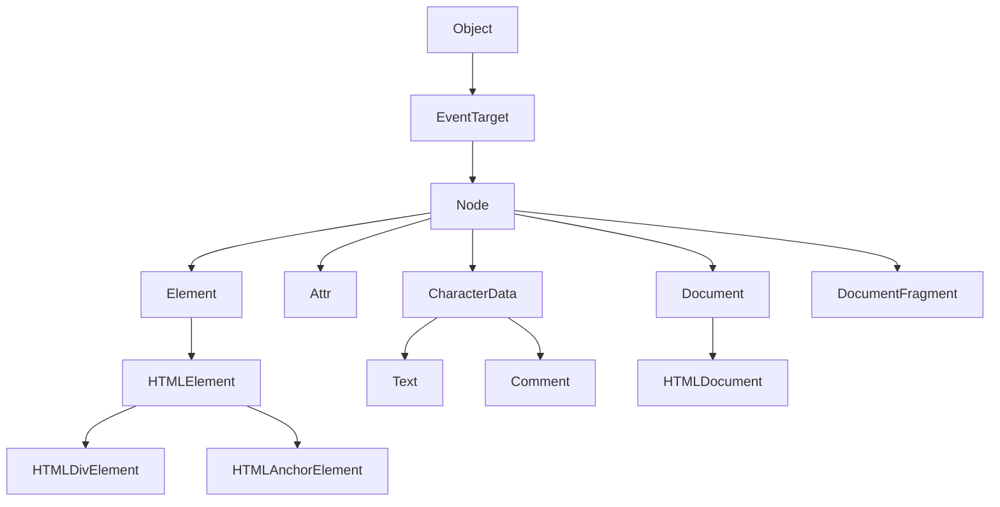

# 39장. DOM

_39장 ~ 699p_

# DOM (Document Object Model)

> HTML 문서의 계층적 구조와 정보를 표현하며 이를 제어할 수 있는 API, 즉 프로퍼티와 메서드를 제공하는 트리 자료 구조이다.

### 트리 자료 구조 (Tree Data Structure)

트리 자료 구조는 부모노드 (parent node)와 자식 노드 (child node)로 구성 되어 노드간의 계층적 구조를 표현 하는 비선형 자료구조이다.

- **노드(Node)**: 트리를 구성하는 기본 단위. 값(데이터)와 하위 노드에 대한 포인터를 가짐.
- **루트 노드(Root Node)**: 트리의 최상위 노드로, 부모가 없음.
- **부모 노드(Parent Node)**: 자식 노드를 가진 노드.
- **자식 노드(Child Node)**: 부모 노드의 하위 노드.
- **형제 노드(Sibling Node)**: 같은 부모를 가진 노드.
- **리프 노드(Leaf Node, 단말 노드)**: 자식 노드가 없는 노드.

### 노드(Node)

노드객체는 12가지의 종류 (노드 타입)이 있고 상속 구조를 갖는다.

#### 문서노드 (document node)

- DOM 트리의 최상위의 존재하는 root node로 `document 객체`를 가리킨다.
- `document 객체`는 브라우저가 렌더링한 HTML 문서 전체를 가리킴. (window의 document 프로퍼티에 바인딩되어 있음)
- 루트 노드이므로 진입점 역할을 한다. 다른 노드에 접근하기 위해 거쳐야만 하는 노드.
- HTML 문서당 document 객체는 유일

#### 요소노드 (element node)

- HTML 요소를 가리키는 객체
- HTML 요소는 HTML 문서를 구성하는 개별적인 요소를 의미한다
- 요소간의 중첩에 부자관계를 가지며, 문서의 구조를 표현한다.

#### 어트리뷰트 노드 (attribute node)

- HTML 요소의 어트리뷰트를 가리키는 객체
- 지정된 HTML 요소의 요소 노드와 연결되어있음
- 부모노드가 없으므로 요소노드의 형제노드는 아님
- 요소노드를 통해 접근할 수 있음

#### 텍스트노드 (text node)

- HTML요소의 텍스트를 가리키는 객체
- 문서의 정보를 표현
- 텍스트는 요소노드의 자식노드이며, 자식노드를 가질 수 없는 리프노드이다 (leaf node) / DOM 트리 최종단

#### 노드 객체의 상속 구조

DOM을 구성하는 노드 객체는 브라우저 환경에서 제공하는 호스트 객체이다 (Host Object.)
(ECMAScrip 사양에 정의된 표준 빌트인 객체 ❌)

- 자바스크립트 객체 이기 때문에 프로토타입에 의한 상속 구조 갖는다.



- **모든 노드 객체**는 `Object`, `EventTarget`, `Node` 인터페이스를 상속받는다.
- **요소 노드**는 `Element`(→ `HTMLElement` → 각종 HTML 요소 객체) 상속
- **문서 노드**는 `Document`(→ `HTMLDocument`) 상속
- **어트리뷰트 노드**는 `Attr` 인터페이스 상속
- **텍스트 및 주석 노드**는 `CharacterData` 인터페이스 상속 (→ `Text`, `Comment`)로 확장

모든 노드 객체는 공통적으로 이벤트를 발생시킬 수 있다.

- `EventTarget.addEventListener`, `EventTarget.removeEventListener`
  모든 노드객체는 트리 탐색 기능, 노드 정보 제공 기능을 제공하는 Node 인터페이스 상속받는다.

| 프로토타입을 제공하는 객체 | 주요 특성 및 역할 요약                                                                |
| -------------------------- | ------------------------------------------------------------------------------------- |
| **Object**                 | 모든 객체의 최상위 프로토타입. 기본 속성 및 메서드(toString, hasOwnProperty 등) 제공. |
| **EventTarget**            | 이벤트 등록 및 관리(addEventListener 등) 기능 제공.                                   |
| **Node**                   | 트리 구조 탐색(parentNode, childNodes 등) 및 노드 정보 관련 메서드 제공.              |
| **Element**                | DOM 요소 공통의 속성/메서드(getAttribute, setAttribute 등) 제공.                      |
| **HTMLElement**            | HTML 요소 전반에 적용되는 속성(className, style 등) 및 동작 제공.                     |
| **HTML\*Element**          | 각 HTML 요소 타입별(예: HTMLInputElement, HTMLDivElement) 고유 속성 및 메서드 제공.   |

## DOM API (Document Object Model Application Programming Interface)

> DOM는, 웹 브라우저가 HTML(또는 XML) 문서를 트리 구조의 객체로 변환한 뒤, 이 객체(노드)들을 자바스크립트 등 프로그래밍 언어로 **접근·조작할 수 있게 해주는 명령(인터페이스)들의 집합**

### 요소 노드 취득

HTML 구조나 내용, 스타일을 동적으로 조작하기 위해 먼저 요소 노드를 취득해야 한다

#### `id` 이용한 취득

> `Document.getElementById` 메서드는 인수로 전달한 id 값을 갖는 하나의 요소 노드를 탐색하여 반환한다.

`getElementById`는 `Document.prototype` 메서드이기 때문에 문서노드인 document를 통해 호출한다.

```js
const target = document.getElementById("id");
```

- `id` 값은 HTML 문서내의 유일한 값이어야 한다.

id 어트리뷰트를 부여하면 id 값과 동일한 이름의 전역 변수가 암묵적으로 선언되어 해당 노드 객체가 할당된다

```html
<!DOCTYPE html>
<html>
  <body>
    <div id="foo">foo</div>
    <script>
      const foo = document.getElementById("foo");
      console.log(foo === document.getElementById("foo")); // true

      // 암묵적 전역으로 생성된 전역 프로퍼티는 삭제되지만 전역 변수는 삭제되지 않는다.
      delete window.foo;
      console.log(foo); // <div id="foo">foo</div>
    </script>
  </body>
</html>
```

```html
<div id="foo">foo</div>
<script>
  let foo = 1;
  // 동일한 이름의 전역변수가 이미 존재하면 이 전역변수에 노드객체가 재할당 되지 않는다
  console.log(foo); // 1
</script>
```

#### `tag name` 이용한 취득

> `Document.prototype/Element.prototype.getElementsByTagName` 메서드는 인수로 전달한 태그 이름을 갖는 요소 노드를 모두 탐색하여 반환한다.
> = 여러개의 노드 객체를 갖는 HTMLCollection 객체를 반환한다.

관습: DOM관련 변수는 앞에 `$` 붙임
`$`를 변수명 앞에 붙이면, 해당 변수에 DOM 요소(또는 DOM 요소의 컬렉션)가 들어있음을 표시

예시:

- `$elem` → 단일 DOM 요소
- `$elems` → 여러 DOM 요소(HTMLCollection, NodeList 등)

```html
<!DOCTYPE html>
<html>
  <body>
    <ul>
      <li id="first">first</li>
      <li id="second">second</li>
      <li id="third">third</li>
    </ul>
    <script>
      // 태그 이름이 'li'인 요소 노드를 모두 탐색해 반환
      // 탐색된 요소노드는 HTMLCollection 객체에 담겨 반환
      // HTMLCollection 객체는 유사배열 객체이면서 이터러블이다.

      const $elems = document.getElementsByTagName("li");

      // 취득한 모든 요소 노드의 style.color 프로퍼티 값을 변경
      // HTMLCollection 객체를 배열로 변환하여 color값 변경
      [...$elems].forEach((elem) => {
        elem.style.color = "red";
      });
    </script>
  </body>
</html>
```

```js
// HTML 문서 내의 모든 요소 노드를 취득
const $all = document.getElementsByTagName("*");
console.log($all); // HTMLCollection(7) [html, body, ul, li#first, li#second, li#third, script]
```

`Document.prototype.getElementsByTagName`와 `Element.prototype.getElementsByTagName`의 차이점

- Document.prototype.getElementsByTagName: 문서 내 모든 요소 노드를 취득
- Element.prototype.getElementsByTagName: 특정 요소의 자손 노드 중에서만 취득

```html
<html>
  <body>
    <ul id="my-list">
      <li id="first">first</li>
      <li id="second">second</li>
    </ul>

    <script>
      // 문서 내 모든 요소 노드를 취득
      const $all = document.getElementsByTagName("*");
      console.log($all);
      // 특정 요소의 자손 노드 중에서만 취득
      const $ul = document.getElementById("my-list");
      const $li = $ul.getElementsByTagName("li");
      console.log($li); // HTMLCollection(2) [li#first, li#second]
    </script>
  </body>
</html>
```

#### `class` 이용한 취득

> `Document.prototype/Element.prototype.getElementsByClassName` 메서드는 인수로 전달한 클래스 이름을 갖는 모든 요소 노드들을 탐색하여 반환한다.

- class 값은 공백으로 구분하여 여러 개의 클래스를 지정할 수 있다.
- HTMLCollection 객체를 반환한다.

```js
// 클래스 이름이 'highlight'인 요소 노드 모두 취득
const highlights = document.getElementsByClassName("highlight");
console.log(highlights); // HTMLCollection(4) [div.highlight, p.highlight, span.highlight, li.highlight]

// 여러 개의 클래스를 가진 요소 취득 (AND 조건)
const importantHighlights = document.getElementsByClassName(
  "important highlight"
);
console.log(importantHighlights); // HTMLCollection [p.important.highlight, li.important.highlight]

// 특정 요소 노드를 통해 호출하면 해당 요소의 자손 노드 중에서만 취득
const list = document.getElementById("my-list");
const listItems = list.getElementsByClassName("item");
console.log(listItems); // HTMLCollection [li.item, li.item]
```

#### `CSS Selector` 이용한 취득

```css
/* 전체 선택자: 모든 요소 선택 */
* {
  ...;
}

/* 태그 선택자: 해당 태그 이름의 요소 선택 */
div {
  ...;
}

/* 클래스 선택자: 특정 클래스명을 가진 요소 선택 */
.container {
  ...;
}

/* ID 선택자: 특정 ID를 가진 요소 선택 */
#header {
  ...;
}

/* 속성 선택자: 특정 속성을 가진 요소 선택 */
input[type="text"] {
  ...;
}

/* 자손(후손) 선택자: div 내부의 모든 span 요소 선택 (직계 자식뿐 아니라 모든 후손 포함) */
div span {
  ...;
}

/* 자식 선택자: ul의 직계 자식 li만 선택 */
ul > li {
  ...;
}

/* 인접 형제 선택자: p 바로 뒤에 오는 ul 하나 선택 */
p + ul {
  ...;
}

/* 일반 형제 선택자: p 뒤에 나오는 모든 ul 선택 */
p ~ ul {
  ...;
}

/* 가상 클래스 선택자: 홀수 번째 li 선택 (1, 3, 5...) */
li:nth-child(odd) {
  ...;
}

/* 가상 요소 선택자: li 앞에 가상 콘텐츠 삽입 */
li::before {
  ...;
}
```

**`Document.prototype/Element.prototype.querySelector`** 메서드는 인수로 전달한 CSS 선택자를 만족하는 하나의 요소 노드를 탐색하여 반환한다.

- 인수로 전달한 CSS 선택자에 매칭되는 요소 노드가 여러 개이면 첫 번째 요소 노드를 반환한다.
- 인수로 전달한 CSS 선택자에 매칭되는 요소 노드가 없으면 `null`을 반환한다.

**`Document.prototype/Element.prototype.querySelectorAll`** 메서드는 인수로 전달한 CSS 선택자를 만족하는 모든 요소 노드를 탐색하여 NodeList 객체로 반환한다.

- 인수로 전달한 CSS 선택자에 매칭되는 요소 노드가 없으면 빈 NodeList 객체를 반환한다.
- NodeList 객체는 유사배열 객체이면서 이터러블이다.

이 두가지 메서드도 `Element.prototype`에 정의된 메서드도 있기 때문에 특정 요소 노드를 호출해 사용할 수 있다.

```html
<!DOCTYPE html>
<html>
  <body>
    <ul id="my-list">
      <li class="apple">apple</li>
      <li class="banana">banana</li>
      <li class="orange">orange</li>
    </ul>
    <script>
      // class가 apple인 첫번째 요소 노드를 취득
      const $apple = document.querySelector(".apple");
      $apple.style.color = "red";

      // ul의 자식 요소 노드 중에서 li 요소 노드를 모두 취득
      const $fruits = document.querySelectorAll("ul > li");
      // 취득한 요소 노드들은 NodeList 객체에 담겨 반환
      console.log($fruits); // NodeList(3) [li.apple, li.banana, li.orange]
      $fruits.forEach((fruit) => {
        fruit.style.color = "blue";
      });
    </script>
  </body>
</html>
```

- CSS 선택자 문법을 사용하는 `querySelector`와 `querySelectorAll` 메서드는 `getElementById`와 `getElementsBy***` 메서드 보다 느리다.
- 그러나 CSS 선택자 문법을 사용하면 구체적인 조건으로 요소 노드를 취득하기 용이하다.
- 따라서 id 어트리뷰트가 있는 요소는 `getElementById` 메서드를 사용하고, 요소의 특정 그룹을 취득해야 하는 경우 `querySelectorAll` 메서드를 사용하는 것이 좋다.

#### 특정 요소 노드를 취득할 수 있는지 확인

> `Element.prototype.matches` 메서드는 인수로 전달한 CSS 선택자를 통해 특정 요소 노드를 취득할 수 있는지 확인하여 boolean으로 반환한다.

특정 요소 노드가 전달한 CSS 선택자와 일치하는지를 확인하여
true 또는 false를 반환한다.

DOM 요소가 특정 조건을 만족하는지 검사할 때 유용함

이벤트 위임이나 조건부 처리에서 자주 사용됨

```html
<!DOCTYPE html>
<html>
  <body>
    <ul id="fruits">
      <li class="fruit apple">Apple</li>
      <li class="fruit banana">Banana</li>
    </ul>

    <script>
      const $apple = document.querySelector(".apple");

      console.log($apple.matches(".apple")); // true
      console.log($apple.matches(".banana")); // false
      console.log($apple.matches("li.fruit.apple")); // true
      console.log($apple.matches("#fruits > li")); // true
    </script>
  </body>
</html>
```

### HTMLCollection과 NodeList

`HTMLCollection`과 `NodeList`는 모두 DOM API가 여러 개의 노드를 반환할 때 사용하는 유사 배열 객체이다.

- 노드객체의 상태 변화를 실시간으로 반영하는 살아있는 객체
- HTMLCollection은 언제나 live 객체로 동작
- NodeList는 대부분 non-live 객체로 동작하지만(querySelectorAll의 반환값), childNodes로 반환되는 NodeList는 live 객체로 동작한다.

#### HTMLCollection

> 노드 객체의 상태 변화를 실시간으로 반영하는 살아있는 DOM 컬렉션 객체

- DOM API에서 `getElementsByTagName`, `getElementsByClassName` 등의 메서드가 반환하는 객체
- **살아있는(live) 컬렉션**: DOM의 변경사항이 실시간으로 HTMLCollection에 반영됨
- 인덱스로 요소에 접근 가능, `item(index)` 메서드로도 접근 가능
- `for...of`, 스프레드 연산자 등으로 순회 가능

##### HTMLCollection 순회 시 주의사항

- HTMLCollection은 live collection이다.
- 즉, DOM이 변경되면 컬렉션도 실시간으로 자동 업데이트된다.
- 따라서 순회 중에 요소를 삭제하거나 클래스 변경 등으로 DOM에서 제외되면
- 컬렉션 길이와 인덱스가 달라져서 예기치 않은 결과가 발생할 수 있다.

```html
<!DOCTYPE html>
<html>
  <body>
    <ul id="fruits">
      <li class="red">Apple</li>
      <li class="red">Banana</li>
      <li class="red">Orange</li>
    </ul>
    <script>
      const $reds = document.getElementsByClassName("red");
      console.log("처음:", $reds.length); // 3

      for (let i = 0; i < $reds.length; i++) {
        $reds[i].className = "blue"; // class 변경 → live 컬렉션에서 제거됨
        // 첫 번째 요소가 제거되면서 나머지 요소들이 앞으로 이동
        // 인덱스는 증가하지만 요소들이 앞으로 이동하여 마지막 요소는 건너뛰게 됨
        console.log(`${i}번째 반복 후:`, $reds.length); // 변화 과정 확인
      }

      console.log("최종:", $reds.length); // 1 - 마지막 요소는 여전히 class="red" 상태로 남아있음
    </script>
  </body>
</html>
```

##### 문제점 해결 방법

```js
// 방법 1: 배열로 변환 후 순회
const reds = Array.from(document.getElementsByClassName("red"));
reds.forEach((el) => {
  el.className = "blue"; // 원본 컬렉션에는 영향 없음
});

// 방법 2: 뒤에서부터 순회 (인덱스 밀림방지)
const reds = document.getElementsByClassName("red");
for (let i = reds.length - 1; i >= 0; i--) {
  reds[i].className = "blue";
}
```

#### NodeList

> 실시간 노드 객체의 상태 변경을 반영하지 않는 non-live 객체

- DOM API에서 `querySelectorAll` 메서드가 반환하는 객체
- 기본적으로 **정적(static) 컬렉션**: DOM 변경 사항이 NodeList에 자동으로 반영되지 않음
- 단, `childNodes` 속성으로 반환되는 NodeList는 예외적으로 살아있는 컬렉션
- `for...of`, 스프레드 연산자 등으로 순회 가능
- `NodeList.prototype`메서드 상속
  - `forEach`, `entries()`, `keys()`, `values()` 등의 배열 메서드 지원
  - 인덱스로 요소에 접근 가능, `item(index)` 메서드로도 접근 가능

```html
<!DOCTYPE html>
<html>
  <body>
    <ul id="fruits">
      <li>Apple</li>
      <li>Banana</li>
      <li>Orange</li>
    </ul>
    <script>
      const $fruits = document.getElementById("fruits");

      // childNodes는 요소 노드와 텍스트 노드(줄바꿈)를 모두 포함하는 살아있는 NodeList를 반환
      const { childNodes } = $fruits;
      console.log("초기 childNodes:", childNodes.length); // 7 (텍스트노드(줄바꿈) + li + 텍스트노드(줄바꿈) + li + 텍스트노드(줄바꿈) + li + 텍스트노드(줄바꿈))

      for (let i = 0; i < childNodes.length; i++) {
        $fruits.removeChild(childNodes[i]);
        // removeChild 호출 시 childNodes가 실시간으로 변경됨
        // i=0: 첫 번째 노드(텍스트) 삭제 → 나머지 노드들이 앞으로 당겨짐
        // i=1: 세 번째 노드(텍스트) 삭제 (원래 두 번째였던 li는 건너뜀)
        // i=2: 다섯 번째 노드(텍스트) 삭제 (원래 네 번째였던 li는 건너뜀)
        console.log(`${i}번째 삭제 후:`, childNodes.length);
      }

      // 결과적으로 모든 텍스트노드는 삭제되고 모든 li 요소노드는 남음
      console.log("남은 childNodes:", childNodes); // NodeList[<li>Apple</li>, <li>Banana</li>, <li>Orange</li>]
    </script>
  </body>
</html>
```
